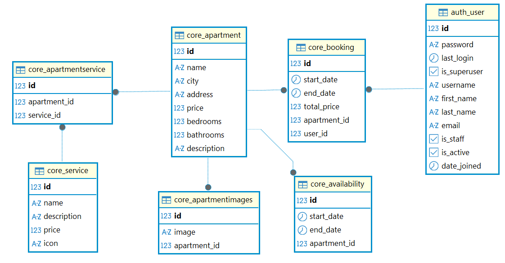

## Ejecución de proyecto

Crear entorno virtual.
```bash
virtualenv venv
source venv/bin/activate
```

Instalar paquetes necesarios
```bash
pip install -r requirements.txt
```

Migraciones
```bash
python manage.py makemigrations
python manage.py migrate
```

Crear superusuario
```bash
python manage.py createsuperuser
```

Activar PostgreSQL
```bash
sudo service postgresql start
```

Ejecutar servidor
```bash
python manage.py runserver
```

Abrir el link: http://127.0.0.1:8000/api/schema/swagger-ui/

## Otros comandos
Verificar version de Python y Django respectivamente
```bash
python --version
python -m django --version
```

## Librerias:
* djangorestframework_simplejwt
* psycopg
* drf-spectacular
* djoser

## Diagrama de flujo


